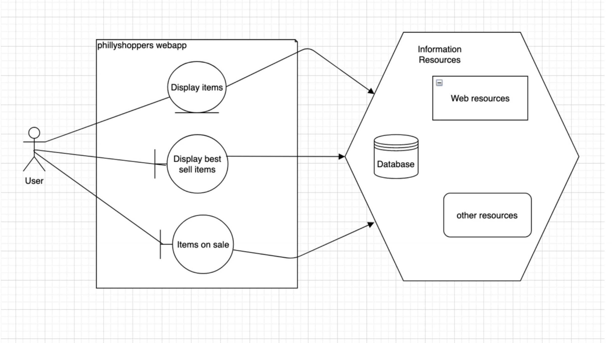

# Phillyshoppers Web app

I have chosen Apache Tomcat open source java development project. I’d like to make web application of modern shopping app name “phillyshoppers.” To build this project I need java, JVM, maven, git, xml and servlet. First of all, I will create pom.xml then main.java and servlet. I will continue using tomcat. The web app is very simple. In order to build it successfully I would have to use IntelliJ for java, Java Servlet, JavaServer Pages, Java Expression. I will be also working on Tomcat to maintain the server. There will be also junit testing and debugging throughout this project. The project is pretty simple and straight forward. It would be a great project since I will be using java for backend and Tomcat to maintain the server.
  
## Project Abstract

Apache Tomcat is very straight forward to use. The reason for choosing Apache Tomcat is a web server that is an open source software implementation of the Java Servlet, JavaServer Pages, Java Expression Language and Java WebSocket technologies. The Java Servlet, JavaServer Pages, Java Expression Language and Java WebSocket specifications are developed under the Java Community Process. Apache Tomcat is developed in an open and participatory environment and released under the Apache. It is intended to be a collaboration of the best-of-breed developers from around the world. Apache Tomcat powers numerous large-scale, mission-critical web applications across a diverse range of industries and organizations.

## Project Relevance

The project includes several goals that are highlighted for the course. I downloaded the projects and in first sections I noticed this project includes object-orientated design, test driven development, Junit testing, parallel computing, design patterns, debugging, XML, data mining and access to data bases. All of these requirements are going to be full filled by this Apache Tomcat project. We can configure and extract the data whatever we want. But in order to configure all files, there must be certain steps we should take to ensure our accuracy. In addition, since Apace Tomcat powers numerous large-scale web software, so it is included XML, HTML, jsp files. It involves maintain all of these data as well. Finally, for fulfilling the second set of goal, I would say working on this project demonstrates testing, building, debugging, version control and issue tracking on apache page.

## Conceptual Design
I'd love to devolve this web app with my group. Since the app is very straight forward to develop. All we will do in this project basic java, xml, servlet. It's a very straight forward web app. I think we can absolutely do this project faster and if we put little amount of time every day. We can use any ide for java and for using Tomcat you will have to install Tomcat 9.0 which is very simple. You can do it on Terminal. 
## Background
Website url: https://projects.apache.org/project.html?tomcat

Building

Do now work with IntelliJ IDEA community edition 2020.2 (I have tried) I have used on MacOS instead.
Select pom.xml when opening project in IntelliJ IDEA. And I also used Tomcat 9.0 for running pom.xml and servlet file.
First build is taking a long time as it is downloading many things but eventually succeed.

Running
Xml and servlet ran successfully in Tomcat 9.0
Do not contain main

Required Resources
Group members competencies
Hardware and software resource required

